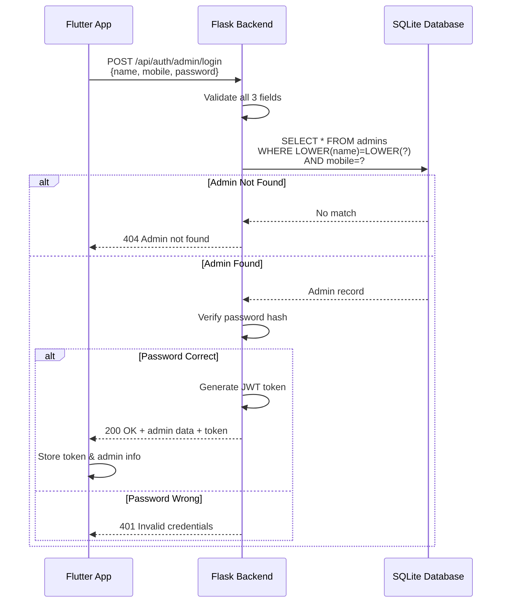

# RG Travel Solution - Admin Login API Documentation

## Updated: Admin Login (3-Field Authentication)

### Endpoint

```
POST /api/auth/admin/login
```

### Description

Admin login now requires **3 fields** for authentication:
1. **Admin Name** - Verified with case-insensitive match
2. **Mobile Number** - Verified exact match (10 digits)
3. **Password** - Verified against stored hash

All three fields must match the database record for successful login.

---

## Request

### Headers

```
Content-Type: application/json
```

### Body

```json
{
  "name": "Rushi Gund",
  "mobile": "9325118627",
  "password": "Rushi123"
}
```

### Field Validation

| Field | Type | Required | Validation |
|-------|------|----------|------------|
| `name` | String | ✅ Yes | Non-empty string, case-insensitive match |
| `mobile` | String | ✅ Yes | Exactly 10 digits |
| `password` | String | ✅ Yes | Non-empty, minimum 4 characters |

---

## Response

### Success Response (200 OK)

```json
{
  "success": true,
  "message": "Login successful",
  "data": {
    "adminId": "adm_a1b2c3d4",
    "name": "Rushi Gund",
    "mobile": "9325118627",
    "token": "eyJhbGciOiJIUzI1NiIsInR5cCI6IkpXVCJ9.eyJ1c2VySWQiOiJhZG1fYTFiMmMzZDQiLCJyb2xlIjoiYWRtaW4iLCJpYXQiOjE3MDcxMjM0NTZ9.abc123xyz"
  }
}
```

### Error Responses

#### 400 Bad Request - Missing Name

```json
{
  "success": false,
  "message": "Admin name is required."
}
```

#### 400 Bad Request - Invalid Mobile

```json
{
  "success": false,
  "message": "Mobile must be exactly 10 digits."
}
```

#### 400 Bad Request - Missing Password

```json
{
  "success": false,
  "message": "Password is required."
}
```

#### 404 Not Found - Name/Mobile Mismatch

When the name + mobile combination doesn't exist in database:

```json
{
  "success": false,
  "message": "Admin not found."
}
```

**Note**: This error occurs when:
- The name doesn't match (even if mobile is correct)
- The mobile doesn't match (even if name is correct)
- The combination doesn't exist

#### 401 Unauthorized - Wrong Password

```json
{
  "success": false,
  "message": "Invalid credentials."
}
```

---

## Example Requests

### cURL Example

```bash
curl -X POST http://localhost:5000/api/auth/admin/login \
  -H "Content-Type: application/json" \
  -d '{
    "name": "Rushi Gund",
    "mobile": "9325118627",
    "password": "Rushi123"
  }'
```

### JavaScript (Fetch API)

```javascript
const response = await fetch('http://localhost:5000/api/auth/admin/login', {
  method: 'POST',
  headers: {
    'Content-Type': 'application/json'
  },
  body: JSON.stringify({
    name: 'Rushi Gund',
    mobile: '9325118627',
    password: 'Rushi123'
  })
});

const data = await response.json();
console.log(data);
```

### Flutter (Dart)

```dart
final response = await http.post(
  Uri.parse('http://10.0.2.2:5000/api/auth/admin/login'),
  headers: {'Content-Type': 'application/json'},
  body: jsonEncode({
    'name': 'Rushi Gund',
    'mobile': '9325118627',
    'password': 'Rushi123',
  }),
);

if (response.statusCode == 200) {
  final data = jsonDecode(response.body);
  final adminName = data['data']['name'];
  final token = data['data']['token'];
  print('Welcome, $adminName!');
}
```

---

## Authentication Flow



---

## Changes from Previous Version

### Before (2-Field Login)

```json
{
  "mobile": "9325118627",
  "password": "Rushi123"
}
```

**Verification**: Mobile → Password

### After (3-Field Login)

```json
{
  "name": "Rushi Gund",
  "mobile": "9325118627",
  "password": "Rushi123"
}
```

**Verification**: Name + Mobile → Password

---

## Security Notes

1. **Password Storage**: Passwords are stored as salted hashes using werkzeug's `generate_password_hash()`
2. **Case-Insensitive Name**: Admin name matching is case-insensitive for user convenience
3. **Token-Based Auth**: Successful login returns a JWT token for subsequent requests
4. **Mobile Uniqueness**: Mobile numbers are unique in the database (enforced by schema)

---

## Database Schema Reference

```sql
CREATE TABLE IF NOT EXISTS admins (
  id              TEXT PRIMARY KEY,
  name            TEXT NOT NULL,
  mobile          TEXT NOT NULL UNIQUE,
  email           TEXT,
  office_name     TEXT,
  office_location TEXT,
  office_address  TEXT,
  password_salt   TEXT NOT NULL,
  password_hash   TEXT NOT NULL,
  created_at      TEXT NOT NULL,
  updated_at      TEXT NOT NULL
);
```

---

## Seeded Admin Account

**Name**: Rushi Gund  
**Mobile**: 9325118627  
**Password**: Rushi123

This account is created via `seeds/seed_admin_custom.py`.
